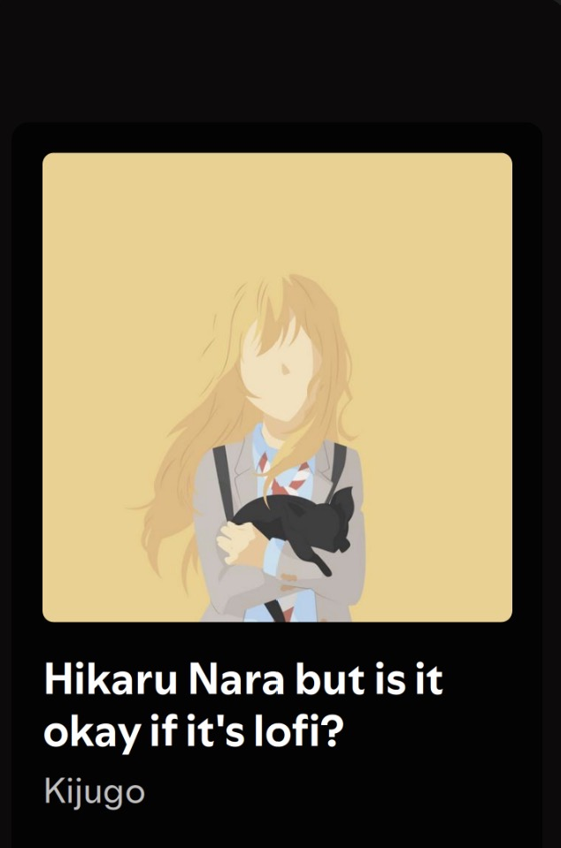
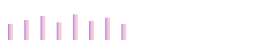

<div align="center">

# 影 A M A N 影


### Python • Artificial Intelligence • Machine Learning

> *"The future is something you create."*

</div>

---

# About Me

```txt
SYSTEM.LOG

Loading profile...

✓ Name........ Aman
✓ Status...... Online
✓ Primary..... Python
✓ Focus....... Artificial Intelligence
✓ Learning.... Machine Learning
✓ Goal........ Build software that matters

Connection Established...
```

---

# Statistics

<div align="center">


</div>

<br>

<div align="center">


</div>

---

# Technologies

<div align="center">


</div>

---

# Currently Learning

```txt
▰ Python Development

▰ Data Structures & Algorithms

▰ Object-Oriented Programming

▰ Git & GitHub

▰ Machine Learning

▰ Artificial Intelligence
```

---

# Projects

```
╭──────────────────────────────────────╮

🤖 AI Projects

Building...

Progress ▰▱▱▱▱

╰──────────────────────────────────────╯
```

---

# Goals

```txt
✓ Build an AI Portfolio

✓ Learn Machine Learning

✓ Contribute to Open Source

✓ Develop Useful Software

✓ Never Stop Learning
```

---
## 🎧 Now Playing

<p align="left">
  
</p>

<p align="left">
  <b>Hikaru Nara (but is it okay if it's lofi?)</b><br>
  Lofi Remix / Chill Version
</p>

<p align="left">
  <a href="https://open.spotify.com" target="_blank">
    🎵 Listen on Spotify
  </a>
</p>

<!-- Lofi Visualizer -->
<p align="left">
  
</p>

# Philosophy

> **"Consistency is Strength."**

```python
class Aman:

    role = "Future AI Engineer"

    learning = [
        "Python",
        "Machine Learning",
        "Artificial Intelligence",
        "Data Structures"
    ]

    current_project = "AI Portfolio"

    motto = "Build. Learn. Repeat."
```

---

# Achievements

<div align="center">


</div>

---

<div align="center">

## Dream it. Build it.

*"If you can dream it, you can achieve it."*

◈ ◈ ◈

Thanks for stopping by.

</div>
